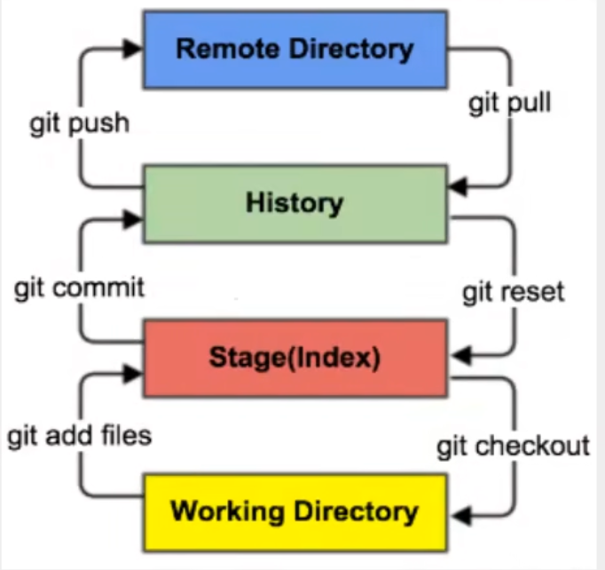

git是分布式版本控制工具
svn是集中式控制工具



新建文件，未跟踪（untracked），使用git add状态变为staged，之后可使用git rm移除版本库；未修改（unmodify）；修改（modified）可使用git add添加到暂存区，也可以用git checkout丢弃修改;staged可以用git commit将修改同步到库中，使用后变为未修改状态，使用git reset head filename取消暂存，文件状态为已修改

## git命令

```zsh
git config -l # 查看配置
git add . # 将所有的需要进行版本管理的文件放入暂存区
git commit -m “说明”  # 将暂存区的文件提交到本地仓库,此时生成记录
git push # 将本地仓库推送到云仓库
git pull # 将云仓库拉到工作区
git init # 初始化项目
git clone url # 下载代码，.git后缀可省略
git status # 检查代码是否变更
git branch # 查看本地分支
  git branch -r # 查看远程分支
  git branch new_codebase_name # 创建新分支
  git branch -d codebase_name # 删除分支
  git branch -dr [remote/branch] # 删除远程分支
  git push origin --delete [branch-name] # 删除远程分支

git checkout oldBranch  # 切换分支
	git checkout -b [branch] #  新建一个分支，并切换到该分支

git reset --hard # 撤销本地修改
git tag -n # 查看项目仓库的标签
	git checkout 标签名  # 查看标签的代码
git diff 标签名1 标签名2 # 对比两个标签之间的不同
# 合并分支
	git merge [branch] # 合并指定分支到当前分支，会产生commit


# 默认忽略上传的文件，在主目录建立“./gitgnore”文件
    #注释           .gitignore的注释
    *.txt           忽略所有 .txt 后缀的文件
    !src.a          忽略除 src.a 外的其他文件
    /todo           仅忽略项目根目录下的 todo 文件，不包括 src/todo
    build/          忽略 build/目录下的所有文件，过滤整个build文件夹；
    doc/*.txt       忽略doc目录下所有 .txt 后缀的文件，但不包括doc子目录的 .txt 的文件

    bin/:           忽略当前路径下的 bin 文件夹，该文件夹下的所有内容都会被忽略，不忽略 bin 文件
    /bin:           忽略根目录下的 bin 文件
    /*.c:           忽略 cat.c，不忽略 build/cat.c
    debug/*.obj:    忽略debug/io.obj，不忽略 debug/common/io.obj和tools/debug/io.obj
    **/foo:         忽略/foo, a/foo, a/b/foo等
    a/**/b:         忽略a/b, a/x/b, a/x/y/b等
    !/bin/run.sh    不忽略bin目录下的run.sh文件
    *.log:          忽略所有 .log 文件
    config.js:      忽略当前路径的 config.js 文件

    /mtk/           忽略整个文件夹
    *.zip           忽略所有.zip文件
    /mtk/do.c       忽略某个具体文件
```

Ssh -keygen -t rsa 创建公钥并以rsa方式加密存储